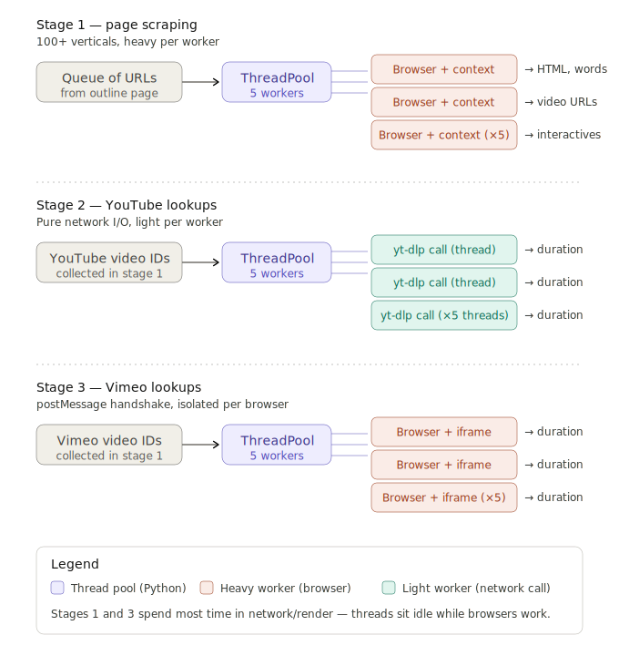

# CourseTimer

Scrapes course pages from WGU's authoring studio and estimates total study time by analyzing HTML text, videos, and interactive elements.

## Setup

**Requires Python 3.10+**

1. **Install dependencies**

```bash
pip install playwright yt-dlp
playwright install chromium
```

2. **Authenticate**

Run the login script to save your browser session:

```bash
python login.py
```

A browser window will open. Log in to WGU Studio manually, then press Enter in the terminal. This saves your session to `auth.json`.

## Running

```bash
python scrape.py
```

The script runs in 3 stages:

| Stage | What it does |
|-------|-------------|
| 1 | Walks every page via the Next button, extracts HTML word counts, video info, and interactive blocks |
| 2 | Looks up YouTube video durations using `yt-dlp` |
| 3 | Looks up Vimeo video durations by embedding iframes on the authenticated WGU domain |

Results are saved to `course_summary.json` after each stage (so nothing is lost if a later stage fails).

## Time Estimation

Total estimated time is calculated per page and for the whole course:

```
estimated_minutes = (html_words / 250) + (video_seconds / 60) + (interactive_count × 3)
```

| Element | Rate |
|---------|------|
| HTML text | 250 words per minute reading speed |
| Video | Actual duration (fetched from YouTube/Vimeo) |
| Interactive blocks | 3 minutes each (flat estimate) |

### Activity & Case Study Recognition

HTML blocks containing resource banner images for **activities** or **case studies** are automatically classified as interactive rather than counted as words. The scraper detects these by matching image `src` attributes:

- `resource_banner-generic-activity.png` → interactive
- `resource_banner-generic-case_study.png` → interactive

These appear in the output with raw type `activity_banner` and contribute 3 minutes each to the time estimate.

These rates are configurable at the top of `scrape.py` (`WORDS_PER_MINUTE`, `MINUTES_PER_INTERACTIVE`).

## Concurrency Workflow

The scraper uses a **ThreadPool with 5 workers** in each stage, but the weight of each worker varies:



### Stage 1 — Page Scraping (heavy workers)

```
Queue of URLs (from outline page) → ThreadPool (5 workers) → Browser + context per worker
```

- Each worker launches its own Chromium browser context
- Workers pull URLs from a shared queue and navigate to each page
- Each browser extracts: HTML word counts, video URLs, and interactive block types
- This is the heaviest stage — each worker holds a full browser instance

### Stage 2 — YouTube Lookups (light workers)

```
YouTube video IDs (from stage 1) → ThreadPool (5 workers) → yt-dlp call per thread
```

- Pure network I/O — no browser needed
- Each thread calls `yt-dlp` to fetch video metadata (duration)
- Lightweight: threads spend most time waiting on network responses

### Stage 3 — Vimeo Lookups (heavy workers)

```
Vimeo video IDs (from stage 1) → ThreadPool (5 workers) → Browser + iframe per worker
```

- Each worker launches a browser and embeds a Vimeo player iframe
- Uses the `postMessage` API handshake to query the Vimeo player for duration
- Requires the authenticated WGU domain as the host page (Vimeo restricts embed access)
- Heavy like Stage 1 — each worker holds a browser instance

### Why threads work here

Stages 1 and 3 spend most of their time in network/render waits — the Python threads sit idle while browsers do the actual work. The GIL isn't a bottleneck because the CPU-bound portion is negligible compared to I/O wait time.

### Diagram Legend (`concurrency.svg`)

| Color | Meaning |
|-------|---------|
| Purple | Thread pool (Python `concurrent.futures.ThreadPoolExecutor`) |
| Orange | Heavy worker — full Chromium browser instance |
| Green | Light worker — network-only call (no browser) |
